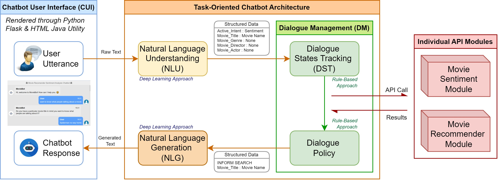

# MovieBot
A task-oriented chatbot designed to perform movie sentiment analysis and movie recommendations through user to chatbot conversations

---

## EXECUTIVE SUMMARY
Modern movies are seeing a division between critics and fans on a more frequent basis. With the advent of social media movie goers are more often seeking the opinions of the masses over those of critics. Additionally, the sheer volume of movies which are becoming available through streaming services can be overwhelming for consumers when it comes to selecting a movie to watch. However, there isn’t any one stop platform available which can help consumers address these problems. We propose a dialogue system which can analyze the sentiment of audiences on social media and provide movie recommendations to users based on their preferences. The dialogue system follows a task-oriented chatbot architecture to achieve the objectives set out above. We explore various approaches and methods when designing the dialogue system, such as Natural Language Understanding/Natural Language Generation architectures, aspect-based sentiment analysis, word embedding based search. Finally, we are able to implement a functioning prototype which is able to converse with a user and perform the tasks outlined above.

---

## CREDITS / PROJECT CONTRIBUTORS
Team Members: 
Lim Jun Ming 
Kennedy Tadhg 
Gopan Ravikumar Girjia

---

## SYSTEM DESIGN

  

---

## METHODOLOGIES / TECHNOLOGIES
1. **Natural Language Understanding** (Intent Classification & Slot Filling)
2. **Natural Language Generation** (Data-to-Text Controllable Text Generation)
3. **Dialogue Management** (Dialogue State Tracking & Dialogue Policy)
4. Abstract-Based **Sentiment Analysis**, ABSA (Astract Extraction/NER)
5. Recommendation System, **Word Embeddings** similarity measurement
6. **Transformer-Based Deep Learning Models** (BERT, DistilBERT, BERTweet, T5)
7. Natural Language Processing Techniques, Libraries and Python Deep Learning Frameworks (NLTK, SpaCy, Pytorch, HuggingFace)

---
## DIALOGUE SYSTEM INTERFACE

  

---
## DIALOGUE SYSTEM INTERFACE
[Project Report](/../PLP_Group 17_MovieBot_Report.pdf)
